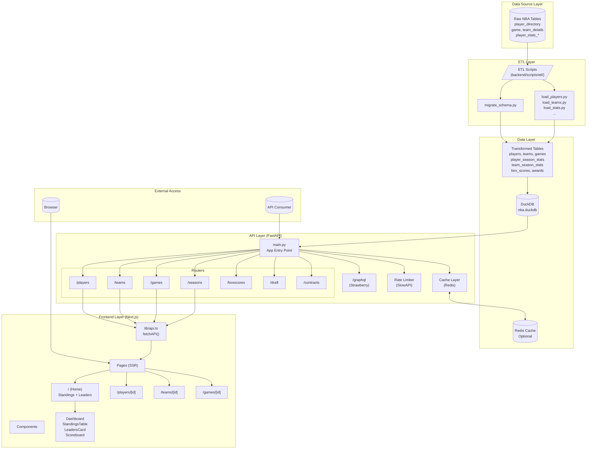

# Codebase Onboarding Guide
## Basketball Reference Clone

---

## Phase 1: The Black Box (Business Context)

### 1. The "Why" - Business Problem Being Solved

This is a **self-hosted, modern reimagining of Basketball-Reference.com** — the definitive NBA statistics database. The project exists to:

| Aspect | Description |
|--------|-------------|
| **Primary Goal** | Provide a comprehensive NBA statistics hub with player profiles, team stats, game scores, historical data, and league leaders |
| **Value Proposition** | Mirror the *data density and utility* of Basketball-Reference, but with a *modern premium UI* (glassmorphism, interactive tables) instead of the dated 1990s aesthetic |
| **Architecture Type** | **Full-Stack Dashboard Application** — not a pipeline, not a microservice. It's a complete user-facing product. |

**Key Insight from `implementation_plan.md`:**
> "We are interpreting 'mirror' as copying the *structure, data density, and utility* of Basketball Reference, but *not* its dated 1990s visual style."

---

### 2. The Boundaries - Inputs & Outputs

```
┌─────────────────────────────────────────────────────────────────────────────────────┐
│                                    SYSTEM BOUNDARY                                   │
├─────────────────────────────────────────────────────────────────────────────────────┤
│                                                                                      │
│   INPUTS                              PROCESSING                      OUTPUTS        │
│   ──────                              ──────────                      ───────        │
│                                                                                      │
│   ┌─────────────────┐                ┌──────────────┐              ┌──────────────┐ │
│   │ Raw NBA Data    │────ETL────────▶│   DuckDB     │◀────────────▶│ REST API     │ │
│   │ (player_dir,    │                │  nba.duckdb  │              │ (FastAPI)    │ │
│   │  game, stats)   │                └──────────────┘              └──────┬───────┘ │
│   └─────────────────┘                                                     │         │
│                                                                           │         │
│   ┌─────────────────┐                                                     │         │
│   │ HTTP Requests   │─────────────────────────────────────────────────────┤         │
│   │ (Browser/API)   │                                                     │         │
│   └─────────────────┘                                                     │         │
│                                                                           ▼         │
│                                                                  ┌──────────────┐   │
│                                                                  │  Next.js UI  │   │
│                                                                  │  (Dashboards,│   │
│                                                                  │   Tables,    │   │
│                                                                  │   Cards)     │   │
│                                                                  └──────┬───────┘   │
│                                                                         │           │
│                                                                         ▼           │
│                                                                  ┌──────────────┐   │
│                                                                  │ HTML/JSON    │   │
│                                                                  │ Responses    │   │
│                                                                  └──────────────┘   │
└─────────────────────────────────────────────────────────────────────────────────────┘
```

| Type | Description |
|------|-------------|
| **Inputs** | Pre-scraped NBA data (raw tables like `player_directory`, `game`, `player_stats_per_game`), HTTP requests from browsers |
| **Data Layer** | DuckDB embedded database (`data/nba.duckdb`) — a single file containing ~50 tables of raw + transformed data |
| **API Layer** | FastAPI REST endpoints + GraphQL (via Strawberry) serving JSON |
| **Outputs** | Server-rendered React pages (Next.js SSR), JSON API responses, Interactive statistics tables |

---

### 3. The Stakeholders - Who Uses This?

| Stakeholder | How They Use It |
|-------------|-----------------|
| **End Users (Sports Fans)** | Browse player stats, team standings, game scores, league leaders via web UI |
| **Developers** | Extend functionality, add new stat categories, build integrations via REST/GraphQL API |
| **Data Analysts** | Query the DuckDB database directly for custom analysis (advanced use case) |
| **Internal Admins** | Run ETL scripts to update data, manage database migrations |

---

## Phase 2: The Architecture (Visuals)

### High-Level Architecture Diagram



### Data Flow Summary

```
1. RAW DATA (scraped)
   └──▶ 2. ETL SCRIPTS (transform)
        └──▶ 3. DUCKDB (storage)
             └──▶ 4. FASTAPI (serve)
                  └──▶ 5. NEXT.JS (render)
                       └──▶ 6. BROWSER (display)
```

---

## Phase 3: The "Spaghetti" Check

### Core Domain Logic Locations

| Layer | Business Rules Location | Description |
|-------|------------------------|-------------|
| **Data Model** | `backend/db/schema.sql` | ⭐ **READ FIRST** - Defines the entire data domain (22 tables) |
| **API Models** | `backend/app/models.py` | Pydantic models mirroring the SQL schema |
| **Routers** | `backend/app/routers/players.py` | Player stats queries, game logs, splits |
| **Routers** | `backend/app/routers/teams.py` | Team stats, roster composition |
| **Routers** | `backend/app/routers/seasons.py` | Season standings, league leaders |
| **ETL** | `backend/scripts/etl/load_*.py` | Data transformation logic (raw → clean) |
| **Frontend Types** | `frontend/src/types/index.ts` | TypeScript interfaces for all entities |

### Utility vs Domain Code

| Type | Files | Notes |
|------|-------|-------|
| **Business Rules** | `routers/*.py`, `schema.sql`, ETL scripts | The "what" and "how" of basketball stats |
| **Generic Utilities** | `database.py`, `cache.py`, `rate_limit.py`, `config.py` | Infrastructure, reusable across projects |
| **UI Utilities** | `lib/api.ts`, `Layout.tsx`, `ErrorBoundary.tsx` | Presentation layer boilerplate |

### Files to Read First (Priority Order)

1. **`backend/db/schema.sql`** — The canonical data model. Everything flows from this.
2. **`backend/app/routers/players.py`** — Most complex router, shows query patterns.
3. **`frontend/src/pages/index.tsx`** — Homepage shows how data is fetched and displayed.
4. **`backend/scripts/etl/load_players.py`** — Example of raw→clean transformation.
5. **`implementation_plan.md`** — Product vision and roadmap.

### Potential "God Classes" / Complex Files

| File | Complexity | Why |
|------|------------|-----|
| `backend/app/models.py` | ⚠️ **High** (400+ lines) | Contains ALL Pydantic models. Consider splitting by domain. |
| `backend/db/schema.sql` | ⚠️ **High** (350+ lines) | Massive schema file. This is acceptable for SQL, but could use inline documentation. |
| `frontend/src/types/index.ts` | ⚠️ **Medium** | Growing list of interfaces; may need splitting. |

---

### Code Smells & Non-Standard Patterns

| Issue | Location | Severity | Explanation |
|-------|----------|----------|-------------|
| **SELECT *** | `routers/players.py:get_player_stats()` | 🟡 Medium | Fetches all columns unnecessarily. Review comments acknowledge this. |
| **Dual Data Schema** | Database | 🟡 Medium | Raw tables (`player_directory`) coexist with transformed tables (`players`). The ETL flow isn't always obvious. |
| **GraphQL queries raw tables** | `graphql_schema.py` | 🟠 High | GraphQL resolvers query `team_details`, `common_player_info` (raw tables), while REST queries transformed tables (`teams`, `players`). This is **inconsistent**. |
| **Hardcoded Season** | `routers/teams.py:get_team_roster()` | 🟡 Medium | `season_id: str = "2025"` — Should come from dynamic lookup. |
| **No Connection Pooling** | `database.py` | 🟢 Low | Uses a global shared connection. Fine for DuckDB, but watch for concurrency issues. |
| **Unused Cache** | `cache.py` | 🟢 Low | Redis cache is implemented but doesn't appear to be wired into routers yet. |
| **Empty Directories** | `backenddb/`, `backendscriptsetl/` | 🟢 Low | Vestigial empty directories. Clean up. |

---

### Quick Reference: API Endpoints

| Endpoint | Description |
|----------|-------------|
| `GET /players` | List players (paginated, searchable) |
| `GET /players/{id}` | Player bio |
| `GET /players/{id}/stats` | Season-by-season stats |
| `GET /players/{id}/gamelog` | Per-game box scores |
| `GET /players/{id}/advanced` | Advanced metrics (PER, WS, VORP) |
| `GET /teams` | List teams |
| `GET /teams/{id}/roster` | Current roster |
| `GET /teams/{id}/stats` | Team season stats |
| `GET /seasons` | List seasons |
| `GET /seasons/{id}/standings` | Conference standings |
| `GET /seasons/{id}/leaders` | League leaders |
| `GET /games` | List games |
| `GET /boxscores/{game_id}` | Full box score |
| `GET /graphql` | GraphQL endpoint |

---

### Tech Stack Summary

| Layer | Technology | Version/Notes |
|-------|------------|---------------|
| **Database** | DuckDB | Embedded OLAP database (single file) |
| **Cache** | Redis | 7-alpine (optional, via Docker) |
| **Backend** | FastAPI + Uvicorn | Python 3.11+ |
| **API Types** | Pydantic | v2 (with pydantic-settings) |
| **GraphQL** | Strawberry | Integrated with FastAPI |
| **Frontend** | Next.js (Pages Router) | React 18, TypeScript |
| **Styling** | Tailwind CSS | Utility-first |
| **Package Mgmt** | uv (Python), npm (JS) | Modern, fast |
| **Linting** | Ruff (Python), ESLint+Prettier (TS) | Industry standard |
| **Containerization** | Docker Compose | Backend + Frontend + Redis |

---

### Development Quick Start

```bash
# Backend (Terminal 1)
cd backend
uv sync
uv run uvicorn app.main:app --reload --port 8000

# Frontend (Terminal 2)
cd frontend
npm install
npm run dev

# Access
# Frontend: http://localhost:3000
# API Docs: http://localhost:8000/docs
# GraphQL:  http://localhost:8000/graphql
```

---

### Recommended Next Steps

1. **Run the app locally** and explore the UI + API docs.
2. **Read `schema.sql`** to understand the data model.
3. **Trace one full request** (e.g., `/players/lebron-james`) from browser → Next.js → FastAPI → DuckDB → response.
4. **Check `implementation_plan.md`** for the product roadmap and upcoming features.
5. **Note the GraphQL inconsistency** — decide whether to unify with REST data layer.

---

*Generated: Codebase Onboarding Guide for Basketball Reference Clone*
